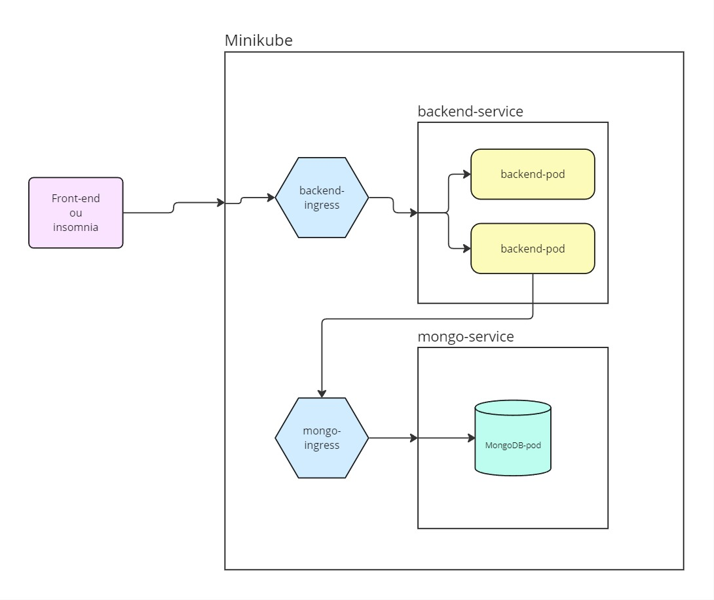
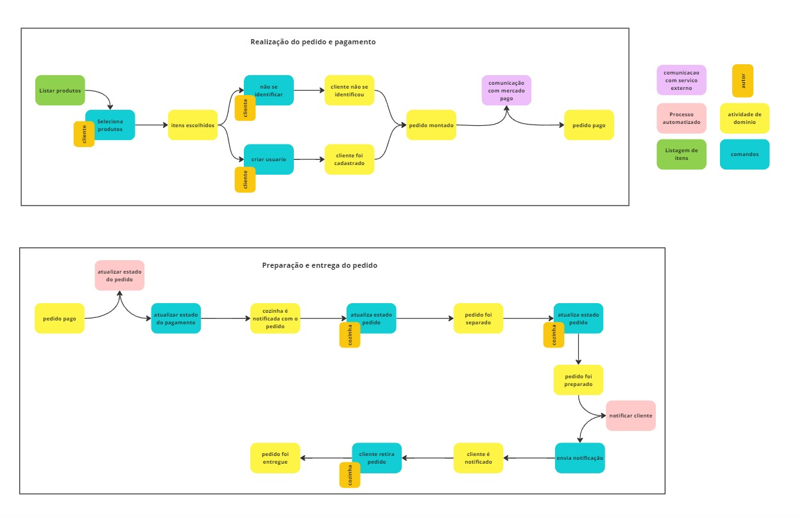

# techchallenge-pos

Sistema de controle de produtos e pedidos de uma lanchonete.

[VÍDEO DE DEMONSTRAÇÃO](https://youtu.be/3njbwij0Hjg)

## Tecnologias

O projeto foi feito usando:
 - Java 21
 - SpringBoot
 - Spring State Machine
 - Banco de dados MongoDB

Com a seguinte arquitetura:


## Funcionamento

O projeto foi pensado como uma forma de solucionar o problema descrito no arquivo [PROBLEMA](utils/doc/problema.md).

A partir da leitura do enunciado, e do processo de _event storm_, foram desenhados os seguintes [DIAGRAMAS](https://miro.com/app/board/uXjVKELC0Wk=/?share_link_id=400487379983) 
que permitiram o desenvolvimento
do projeto:



Com base em endpoints é possivel cadastrar e gerenciar os produtos de uma lanchonete, tais podutos foram pensados para
serem armazenados em 4 categorias:
 - Acompanhamentos
 - Bebidas
 - Lanches
 - Sobremesa

Há ainda endpoints para cadastro e gerenciamento de clientes, caso estes optem por se cadastrarem no sistema, 
e endpoints para armazenar e listar os pedidos, e permitir a cozinha alterar os estados destes de acordo com a produção.

Os endpoints estão listados na pagina do 
Swagger (o index "/" faz um redirecionamento para essa documentação).

O fluxo esperado de um pedido é: 
1. POST /pedido -> criação do pedido
2. GET /pago -> mock de pagamento
3. PATCH /recebido -> enviar pedido para a cozinha
4. PATCH /empreparacao -> cozinha preparando o pedido
5. PATCH /pronto -> cozinha finalizando o preparo do pedido
6. PATCH /finalizado -> pedido entregue ao cliente

Para mais informações a respeito dos endpoints há uma [DOCUMENTAÇÃO](utils/doc/endpoints.md) detalhada.

## Rodando local

Afim de facilitar o uso e testes do projeto, desenvolvemos um docker-compose já com todas as configurações necessarias.

Para rodar o projeto basta usar comando:

````bash
docker-compose up -d 
````

Os containers usarão as portas:
- 8082 - MongoDB
- 8083 - Backend

Há uma collection para insomnia com as requisições mapeadas na [UTILS](utils)